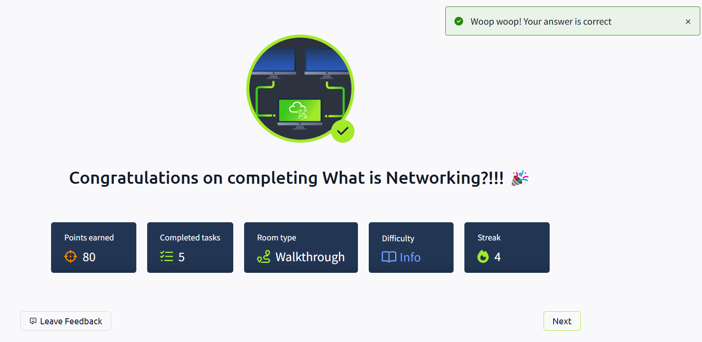

# TryHackMe - What is Networking? - Learning Log

## ✅ Completed Room: What is Networking?

### Overview
This room introduced the fundamentals of networking and explained how devices communicate with each other, both locally and over the Internet.  
Key concepts included IP addressing, MAC addresses, and the basics of the Internet itself.

### Key Concepts Learned

#### 🌐 What is Networking?
- A network is simply a collection of connected devices.
- Networks exist in daily life (e.g., postal systems, power grids) and in computing (e.g., home networks, corporate networks).

#### 🌍 What is the Internet?
- The Internet is a global network of interconnected private and public networks.
- Originated from the ARPANET project in the 1960s, with the World Wide Web created in 1989 by Tim Berners-Lee.

#### 🖥️ Identifying Devices on a Network
- Devices use **IP addresses** and **MAC addresses** for identification.
- IP Addresses:
  - Private IP: Used within local networks.
  - Public IP: Used for communication over the Internet.
- MAC Addresses:
  - Hardware-based unique identifier.
  - Can be spoofed to impersonate devices.

#### 🛰️ Ping (ICMP)
- Ping uses ICMP protocol to test the connection between devices.
- Sends echo requests and receives echo replies.
- Practical exercise: Ping 8.8.8.8 to see round-trip time and packet delivery.

### Reflection
- Networking is the foundation of communication between devices.
- Understanding basic concepts like IP addresses and MAC addresses is crucial for cybersecurity.
- Practical labs provided insights into how devices communicate and identify each other.

### Screenshot

### Next Steps
- Move on to "Intro to LAN" room to explore local area networks in more detail.
- Continue documenting each learning step to build a comprehensive cybersecurity portfolio.
